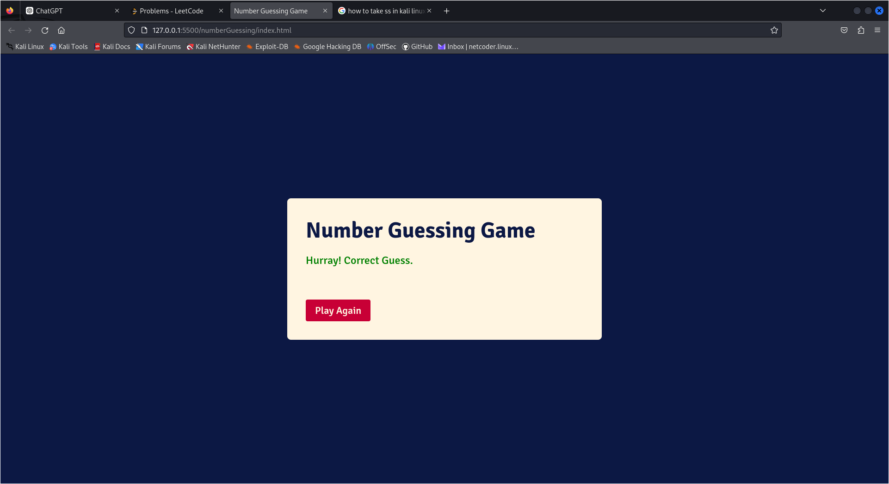

# Number Guessing Game

This is a simple Number Guessing Game built with HTML, CSS, and JavaScript. The game generates a random number between 1 and 100, and the player has to guess the correct number from four given options. The game shows feedback if the guess is correct or incorrect and provides an option to play again after a correct guess.

## Features

- **Start Game**: Click the `Start Game` button to begin.
- **Random Number Generation**: A random number between 1 and 100 is generated for each round.
- **Multiple Choice Options**: The game displays four number options, one of which is the correct answer.
- **Feedback**: Shows a message ("Hurray! Correct Guess" or "Oops! Try Again") based on the player's guess.
- **Play Again**: After guessing correctly, the player can click the `Play Again` button to restart the game with new random numbers.

## Technologies Used

- **HTML5**: Structure of the game.
- **CSS3**: Styling the UI.
- **JavaScript**: Game logic, random number generation, and user interaction.

## How to Run the Game

1. Clone the repository or download the code files.
2. Open the `index.html` file in your browser.
3. Click the `Start Game` button to begin playing.

## Game Flow

1. **Start the Game**: The player clicks on the `Start Game` button to begin the game.
2. **Guess the Number**: Four random numbers are displayed as buttons. The player must click one to make a guess.
3. **Feedback**: If the guess is correct, the player sees a success message, and the option to play again. If incorrect, the player is prompted to try again.
4. **Play Again**: Once the correct number is guessed, the `Play Again` button appears, allowing the player to start over with new numbers.

## Contact

Feel free to reach out if you have any questions or suggestions!

- [Website](https://adityadhiman-in)
- [GitHub](https://github.com/adityadhiman-in)
- [LinkedIn](https://www.linkedin.com/in/adityadhiman-in)

Made with ❤️ by Aditya Dhiman